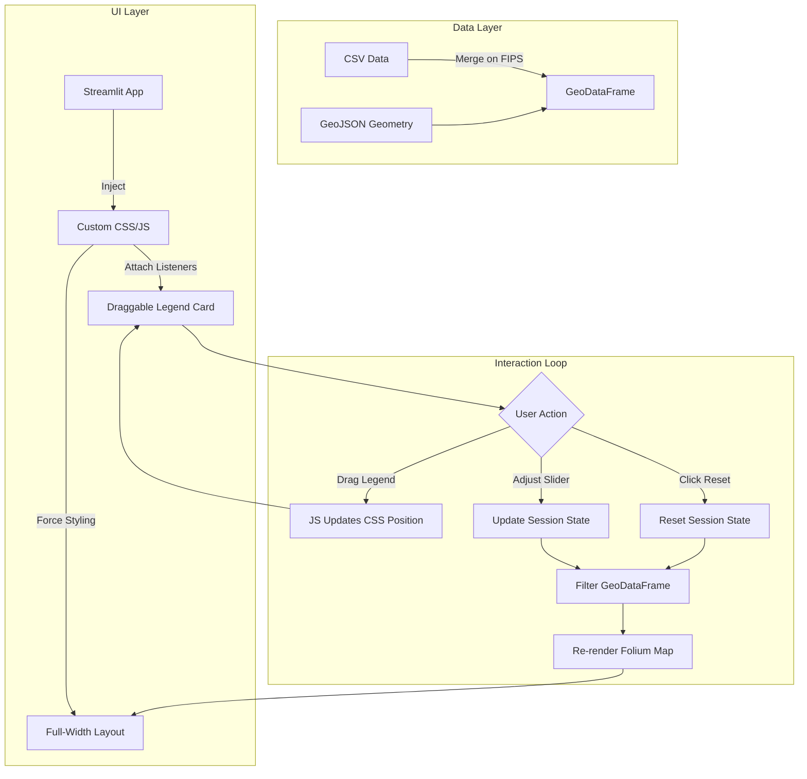

# 🗺️ Geo-Legend: Interactive Demographics Map

**Geo-Legend** is a professional-grade interactive map application built with Streamlit and GeoPandas. It visualizes Florida's median age demographics with a premium, custom-engineered user interface that pushes the boundaries of standard Streamlit capabilities.

## 🌟 Key Functionalities

### 1. 🖥️ Edge-to-Edge Full Screen Map
Unlike standard Streamlit apps that have wide margins, this application overrides the layout engine to render a **true full-width map**, providing an immersive data exploration experience.

### 2. 🎴 Floating "Card View" Legend
A custom-designed, semi-transparent legend card that floats above the map.
- **Draggable**: Grab the header to move the legend anywhere on the screen.
- **Premium UI**: Styled with drop shadows, rounded corners, and a custom gradient color bar.

### 3. ⚡ Real-Time Interactive Filtering
- **Dual-Handle Slider**: Users can filter specific age ranges (e.g., show only counties with a median age between 40 and 50).
- **Instant Updates**: The map dynamically updates in real-time as you slide, thanks to optimized GeoPandas filtering logic.

### 4. 🔄 Smart Reset
A dedicated "Reset Filter" button that instantly snaps the view back to the default dataset state using session state management.

---

## 🔧 How It Works: Under the Hood

This application is not just a standard library implementation. It uses advanced techniques to overcome platform limitations:


### 🐍 The Data Engine (Python & GeoPandas)
- **Data Ingestion**: Merges purely statistical CSV data with GeoJSON geometries based on FIPS codes.
- **Visuals**: Uses `folium` with the `cartodbpositron` tile set for a clean, professional look that allows the data layers to pop.

---

## 📈 Application Workflow



## 🚀 Usage
1. **Install Requirements**:
   ```bash
   pip install -r requirements.txt
   ```
2. **Run the App**:
   ```bash
   streamlit run map_app.py
   ```
